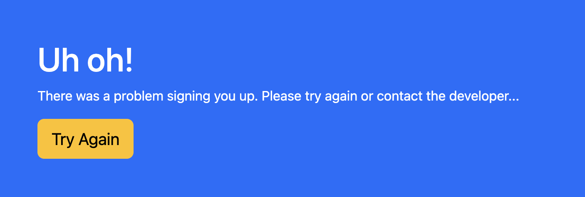

# Newsletter Signup Page

This is a newsletter signup form using Mailchimp API. A user fills out the form and then they are added to the Mailchimp newsletter. This project focuses primarily on back-end development and uses Node.js, Express.js, and Bootstrap.

---

## Success Page

Upon successful form submission the user will be redirected to a successful page letting them know.

---

## Failure Page

Upon successful form submission the user will be redirected to a failure page letting them know. There is a "Try Again" button which will redirect them back to the newsletter signup form page.

---

### .env

Notice the .env_sample file. You will need to create a .env file and add your unique API's and Audience/List ID provided with your Mailchimp account info. This uses dotenv to store the personal API as process in code. More info can be found here about dotenv: https://www.npmjs.com/package/dotenv
